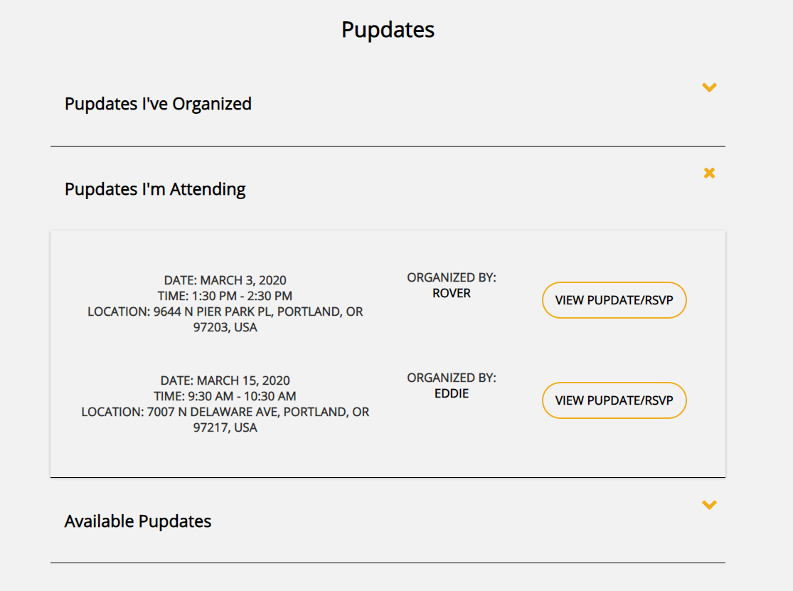
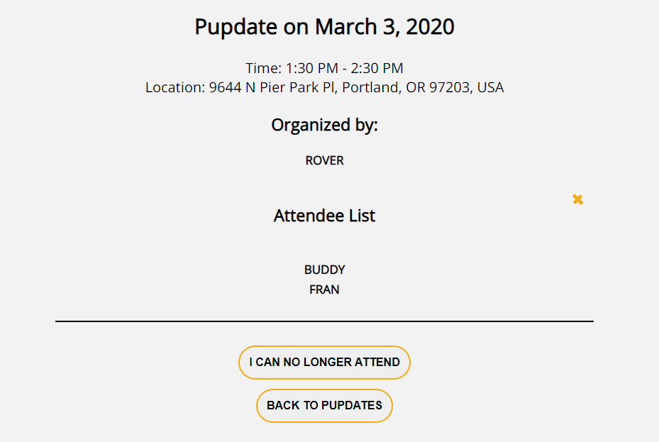
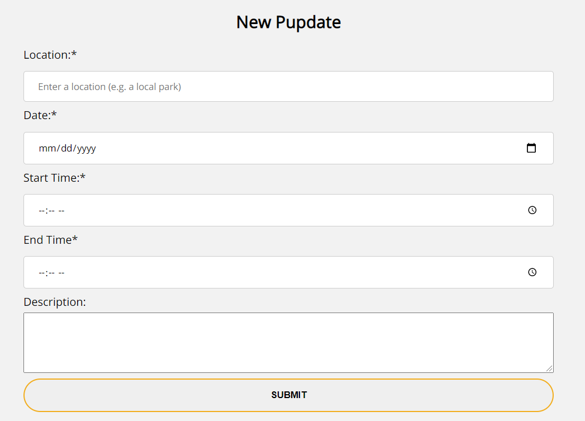
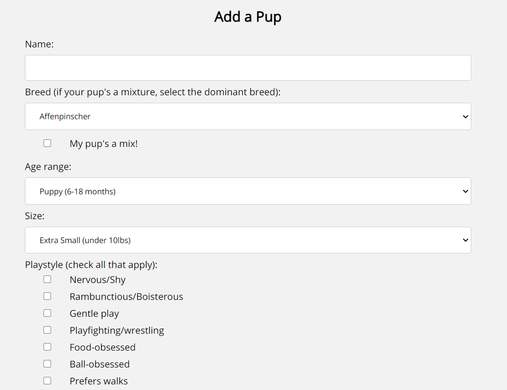
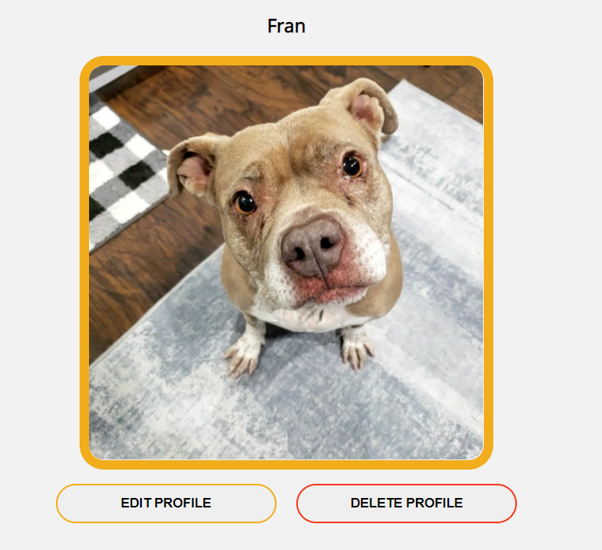

# pupdate

View pupdate [here](https://pupdate-app.vercel.app/).

View the server repo [here](https://github.com/sallygaller/pupdate-api).

pupdate is an app designed for dog owners to schedule playdates for their pups. pupdate users can quickly see and RSVP to pupdates happening in their area, and see profiles of the pups attending. Pup profiles contain pertinent information including breed, age, size, and playstyle to ensure a happy playdate. 

## How to Use
### Logging In
Users may login with a demo account (using the credentials provided on the Login page), register for their own account, or login with an existing account. 

### Pupdates
The Pupdates page is the central hub of the application. This is where users can see pupdates they're attending, pupdates that are happening in their area, and pupdates they've organized. Users can see which pup is "organizing" each pupdate, and click to view more details and RSVP. 

### Pupdate
The Pupdate page shows more information about each pupdate, including an attendee list. This is where users can RSVP to pupdates, and where organizers can edit or delete their pupdates. 

### New Pupdate
The New Pupdate form allows the user to create a pupdate for other users to RSVP to:
- Location
- Date
- Start time 
- End time
- Description

### New Pup
The New Pup form allows the user to log pertinent details about their pup. Other pupdate users can see this profile when scheduling pupdates:
- Name
- Breed
- Age
- Size
- Playstyle
- Description
- Photo

### My Pups
The My Pups page allows users to view, edit, and delete their pup profiles. 

## Technology Used
- HTML
- CSS
- JavaScript
- React
- Jest
- Enzyme
- Amazon S3
- [Google Places API](https://developers.google.com/maps/documentation/places/web-service/overview)